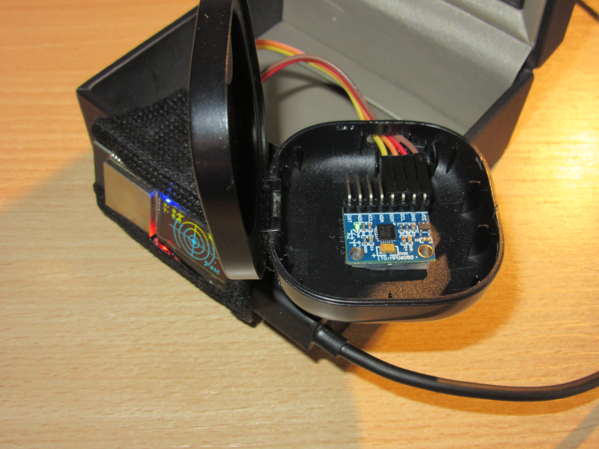
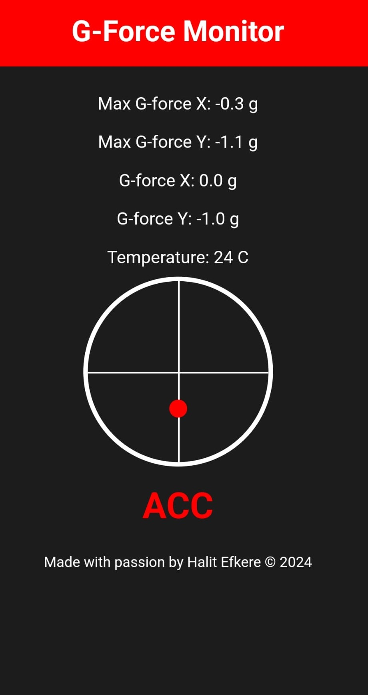
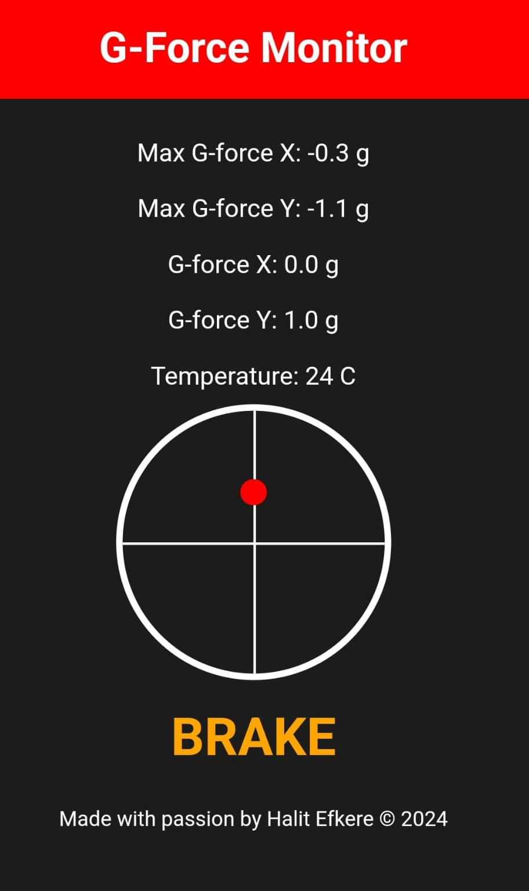
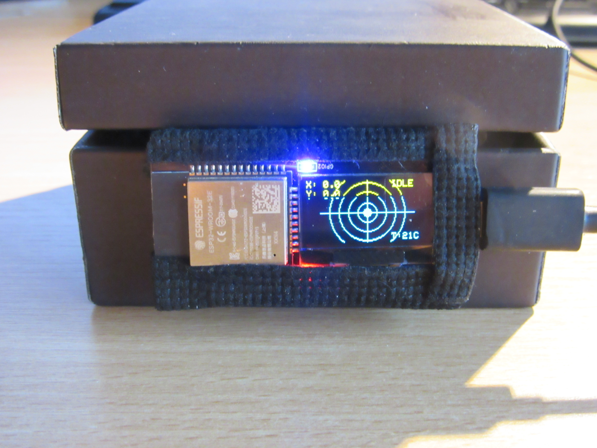
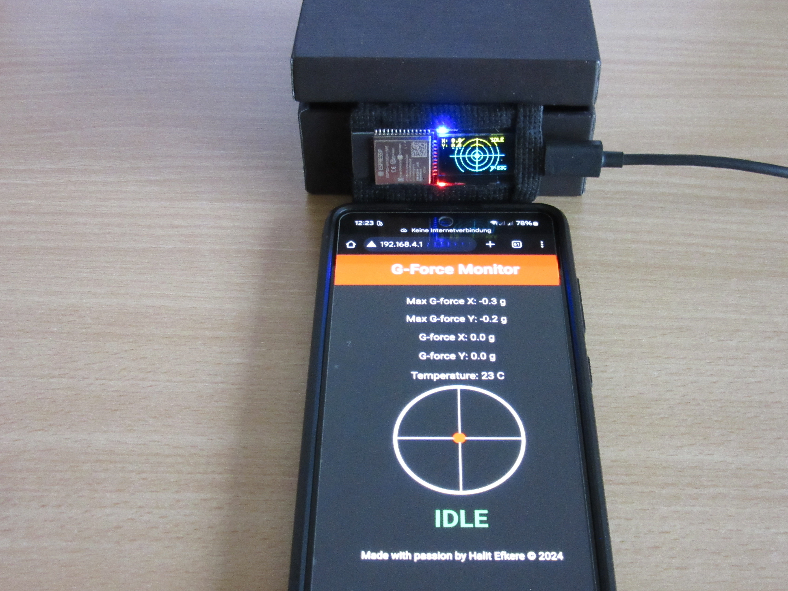

# G-Force Monitor by Halit Efkere

## Table of Contents
- [Overview](#overview)
- [Features](#features)
- [Components](#components)
- [Prerequisites](#prerequisites)
- [Setup and Installation](#setup-and-installation)
  - [Wiring Diagram](#wiring-diagram)
  - [Code Installation](#code-installation)
  - [Calibration](#calibration)
- [Web Server Interface](#web-server-interface)
- [OLED Display Interface](#oled-display-interface)
- [Example Output](#example-output)
- [Future Improvements](#future-improvements)
- [Acknowledgments](#acknowledgments)
- [License](#license)

## Overview

The **G-Force Monitor** is a real-time system designed to measure and display the G-forces experienced in a vehicle. This project leverages an ESP32 microcontroller, an MPU6050 accelerometer, and an OLED display to visualize acceleration, braking, and turning forces. It also provides temperature readings from the ESP32 sensor, all displayed on a web-based interface accessible via Wi-Fi.

This monitor is ideal for automotive enthusiasts and developers seeking insights into their vehicle's performance or the effects of driving dynamics on passengers.

## Features

- **Real-time G-Force Measurement**: Measures and visualizes X and Y-axis G-forces.
- **Dynamic Web Interface**: Access real-time data from any device connected to the ESP32 Wi-Fi network.
- **Graphical OLED Display**: Visualizes G-force data in a circular graph with concentric indicators.
- **Temperature Monitoring**: Shows real-time temperature readings from the ESP32 internal sensor.
- **On-Board LED Status Indicator**: Uses the ESP32's on-board LED (LED2) to indicate ACC, BRAKE, TURN, and IDLE states.

## Components

- **ESP32 Microcontroller** (with on-board LED, referred to as `LED2`)
- **MPU6050 Accelerometer**
- **Adafruit SSD1306 OLED Display (128x64)**
- **Jumper Wires and Breadboard (if needed)**

## Prerequisites

- **Arduino IDE** with ESP32 board support installed.
- **Libraries**:
  - `Wire.h`
  - `Adafruit_GFX.h`
  - `Adafruit_SSD1306.h`
  - `MPU6050.h`
  - `WiFi.h`
  - `WebServer.h`

## Setup and Installation


### Wiring Diagram

1. **MPU6050 to ESP32**:
   - **VCC** -> 3.3V
   - **GND** -> GND
   - **SCL** -> GPIO22 (I2C SCL)
   - **SDA** -> GPIO21 (I2C SDA)


2. **On-Board LED (LED2)**:
   - This project uses the on-board LED of the ESP32, typically connected to GPIO2. This LED will blink or change state based on the G-Force conditions.


### Code Installation

1. **Open Arduino IDE** and ensure that you have the necessary libraries installed.
2. **Copy the provided code** into a new sketch.
3. **Configure your Wi-Fi credentials** within the code, if needed:
   ```cpp
   const char *ssid = "G-Force Monitor";
   const char *password = "123456789";
   ```
4. **Upload the sketch** to the ESP32 board using the appropriate settings.

### Calibration

Once the code is successfully uploaded, the system will start in calibration mode. The MPU6050 will be automatically calibrated to set the zero-point offsets. This step ensures that any sensor biases are accounted for during measurements.

## Web Server Interface

### Description

The web interface allows you to monitor the real-time G-force data and temperature readings from the ESP32 via Wi-Fi. You can access it by connecting to the "G-Force Monitor" Wi-Fi network and navigating to `http://192.168.4.1` in a web browser.




### Features

- Displays real-time G-force values (X and Y-axis) and maximum recorded G-forces.
- Visual indicator for acceleration, braking, and turning movements.
- Shows internal ESP32 temperature in Celsius.
- Responsive marker that indicates G-force position.

## OLED Display Interface

### Description

The OLED display provides a graphical representation of the G-force data. The circular graph shows concentric circles representing different G-force levels, with a marker indicating the current position.



### Layout

- **Graphical Display**: A circle with concentric indicators to denote different levels of G-force intensity.
- **Status Indicators**: The top-right section shows ACC, BRAKE, TURN, and IDLE based on current G-forces.

## Example Output

Below are examples of the outputs you can expect from the G-Force Monitor system:

- **Status Indicators**:
  - **ACC** for forward acceleration.
  - **BRAKE** for braking forces.
  - **TURN LEFT** and **TURN RIGHT** for left and right turns.



## Future Improvements

- **Data Logging**: Add support for storing and exporting G-force and temperature data over time.
- **Extended Web Interface**: Enhance the web interface to include historical data visualization.
- **Additional Sensors**: Integrate a GPS module to track speed and location information.

## Acknowledgments

Special thanks to the open-source community and contributors for their guidance and resources. The project is inspired by real-world automotive data visualization needs.

## License

This project is licensed under the [MIT License](link-to-license). See the LICENSE file for more information.
